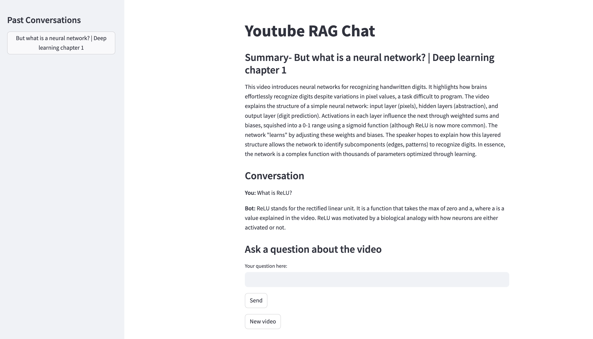

# 🎬 YouTube RAG Chat

  

An end-to-end Retrieval-Augmented Generation (RAG) application that lets you summarize and chat with YouTube videos.

Built with **FastAPI**, **Streamlit**, **ChromaDB**, and **Google Gemini / Ollama LLMs**, fully containerized and production-ready.

  



*Example Streamlit interface – summarize and chat with any YouTube video.*

  

## ✨ Features

- **YouTube Summarization** – Extract transcripts and generate concise video summaries.

- **Conversational Q&A** – Ask natural-language questions about video content, powered by RAG.

- **Persistent Memory** – User chat history stored via SQLModel (SQLite/Postgres ready). Streamlit side-panel allows access to old conversations.

- **Efficient Vector Search** – Chunked transcript embeddings stored in ChromaDB for retrieval.

- **Modern Full-Stack** – FastAPI backend + Streamlit frontend, containerized with Docker Compose.

- **Extensible LLM Integration** – Works with **Google Gemini** (default) or local **Ollama** for offline usage.

- **Proxy Integration** – Built-in optional proxy connection for Youtube API requests.

  

## 🛠️ Tech Stack

- **Backend:** FastAPI, SQLModel, ChromaDB

- **Frontend:** Streamlit

- **LLMs:** Google Gemini API (default) | Ollama (local Llama 3.2 + Nomic embeddings)

- **Database:** SQLite (dev) → Postgres (production ready)

- **Containerization:** Docker, Docker Compose

- **Testing & CI/CD:** Pytest, GitHub Actions, Flake8, Black, Mypy

  

## 🏗️ Architecture

1. **Frontend (Streamlit)** – User enters YouTube URL, sees summary, chats with video.

2. **Backend (FastAPI)** – Handles API requests, manages sessions, and stores chat history.

3. **Transcription Service** – Retrieves/caches transcripts with `yt-dlp`.

4. **Chunking & Embedding** – Transcript split into chunks → embedded with Gemini/Nomic embeddings → stored in ChromaDB.

5. **RAG Pipeline** – Retrieves relevant context chunks, injects into LLM prompt.

6. **Database (SQLModel)** – Stores transcripts, summaries, and chat messages for persistence.

  

## 🚀 Getting Started

### Prerequisites

- Docker & Docker Compose

- A Google Gemini API key
- [Optional] or Ollama installed locally (for Llama 3.2 + Nomic embeddings).

  
### Clone

```bash
git clone https://github.com/dan-levy22/Youtube-RAG-Chat.git
cd Youtube-RAG-Chat
```

### Configuration

1) Copy the example env and fill in your secrets:

```bash
cp .env.example .env
```

	*Then open .env and set GEMINI_API_KEY=...*

### Run locally:

```bash
docker-compose up --build
```

## 💡 Usage

1. Open the Streamlit app (`http://localhost:8501`).

2. Enter a YouTube video URL.

3. Get a **summary** of the video.

4. Start chatting with the assistant about video content!

## ✅ Testing

This project includes **unit and integration tests** with Pytest.

Run tests:

```bash
pytest -v
``` 